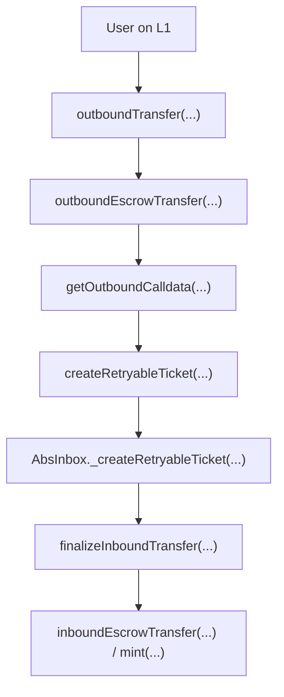
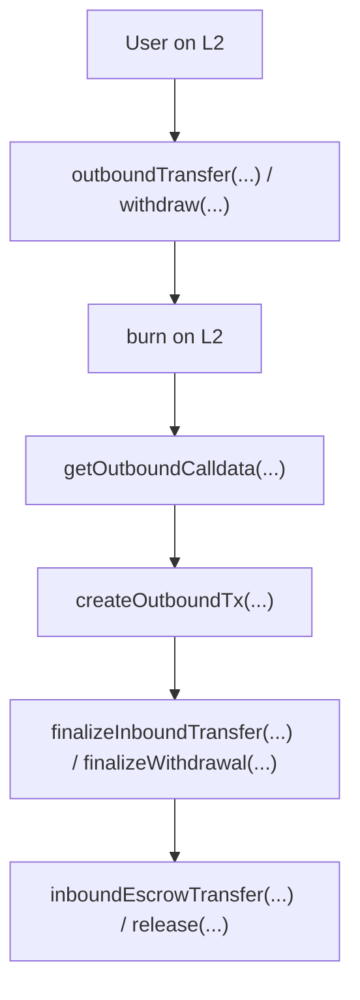

# Arbitrum Bridge Flow Local Review RU

Это русская версия учебного разбора Arbitrum bridge flow.

Цель репозитория - показать, как я разбираю мост через метод:

```text
Понять flow -> определить инварианты -> искать, где они могут нарушиться
```

Это не официальный аудит Arbitrum. Это portfolio-style разбор архитектуры, deposit flow, withdrawal flow, calldata, retryable tickets, message passing, auth boundaries и accounting.

## Основная идея моста

Bridge не переносит токен физически между сетями.

Обычно происходит так:

```text
source chain: token lock / burn
destination chain: token mint / release
```

Главная формула:

```text
Source chain amount = Destination chain amount
```

## Deposit Flow: L1 -> L2



Главная формула deposit:

```text
L1 escrowed amount = L2 minted / released amount
```

## Withdrawal Flow: L2 -> L1



Главная формула withdrawal:

```text
L2 burned amount = L1 released amount
```

## Главные функции

Deposit:

```text
outboundTransfer(...)
outboundEscrowTransfer(...)
getOutboundCalldata(...)
createRetryableTicket(...)
AbsInbox._createRetryableTicket(...)
finalizeInboundTransfer(...)
inboundEscrowTransfer(...) / mint(...)
```

Withdrawal:

```text
outboundTransfer(...) / withdraw(...)
burn(...)
getOutboundCalldata(...)
createOutboundTx(...)
finalizeInboundTransfer(...) / finalizeWithdrawal(...)
inboundEscrowTransfer(...) / release(...)
```

## Структура репозитория

```text
arbitrum-bridge-flow-local-review-ru/
+-- README.md
+-- deposit-flow/
+-- withdrawal-flow/
+-- concepts/
+-- break-think/
```

## Что я тренирую

```text
bridge flow analysis
function-by-function review
amount consistency
token mapping
recipient preservation
message authenticity
replay protection
address aliasing
retryable ticket flow
```
