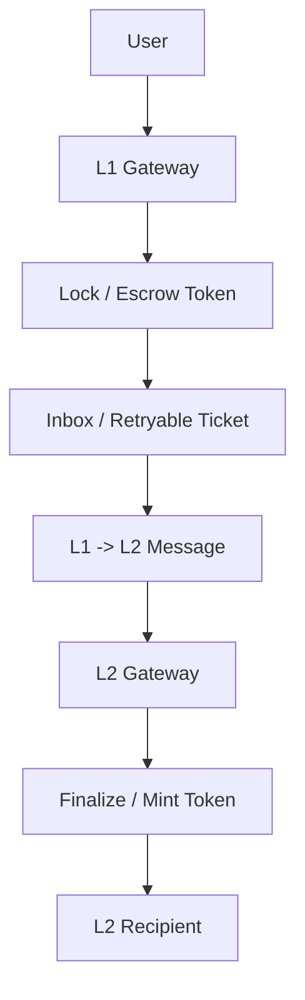
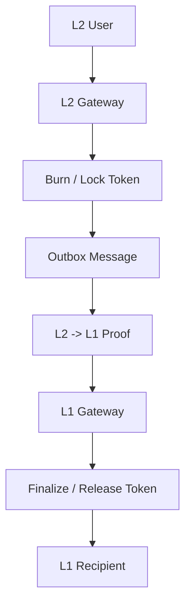

# Arbitrum Bridge Flow Local Review RU

Этот репозиторий — русская версия моего локального разбора Arbitrum-style bridge flow.

Цель репозитория — показать, как я изучал архитектуру моста, deposit flow, withdrawal flow и важные security-моменты на уровне отдельных функций.

Это учебный portfolio project. Это не официальный аудит Arbitrum и не security assessment production deployment.

---

## Что внутри

```text
deposit-flow/
```

Разбор функций deposit flow: путь L1 -> L2.

```text
withdrawal-flow/
```

Разбор функций withdrawal flow: путь L2 -> L1.

```text
concepts/
```

Отдельные важные понятия, например Arbitrum address aliasing.

```text
breaksync/
```

Папка под будущий ручной BreakSync-style анализ.

---

## Bridge Flow Overview

Deposit direction:



Withdrawal direction:



---

## Как я изучал

Я разбирал мост поэтапно:

1. Сначала изучил общую архитектуру bridge.
2. Потом прошел весь deposit flow.
3. Потом прошел весь withdrawal flow.
4. После этого начал разбирать важные функции отдельно.
5. Затем оформил заметки в структуру репозитория.

Частично я использовал AI как инструмент для организации заметок и оформления текста. Основная цель работы — показать мой процесс обучения: flow tracing, invariant thinking и понимание security boundaries.

---

## Структура репозитория

```text
arbitrum-bridge-flow-local-review-ru/
|
|-- README.md
|
|-- deposit-flow/
|   |-- 01-outboundTransfer.md
|   |-- 02-outboundEscrowTransfer.md
|   |-- 03-getOutboundCalldata.md
|   |-- 04-createRetryableTicket.md
|   |-- 05-AbsInbox-createRetryableTicket.md
|   |-- 06-finalizeInboundTransfer.md
|   `-- 07-inboundEscrowTransfer-or-mint.md
|
|-- withdrawal-flow/
|   |-- 01-outboundTransfer-or-withdraw.md
|   |-- 02-burn-or-lock.md
|   |-- 03-getOutboundCalldata.md
|   |-- 04-createOutboundTx.md
|   |-- 05-finalizeInboundTransfer-or-finalizeWithdrawal.md
|   `-- 06-inboundEscrowTransfer-or-release.md
|
|-- concepts/
|   `-- address-aliasing.md
|
`-- breaksync/
    `-- README.md
```

---

## Текущий scope

Сейчас репозиторий сфокусирован на:

- общей схеме bridge flow
- deposit flow notes
- withdrawal flow notes
- объяснении функций
- инвариантах
- важных bridge concepts

`breaksync/` зарезервирован под будущий более глубокий ручной анализ.

---

## Disclaimer

Этот репозиторий создан для обучения и портфолио.

Он не является официальным аудитом и не должен восприниматься как security assessment production-контрактов.
