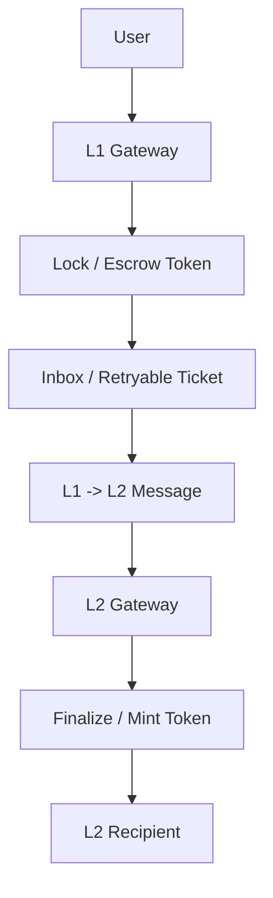
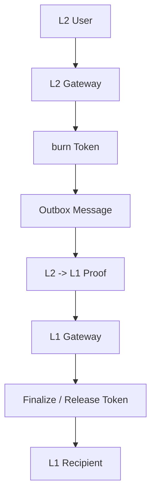

# Arbitrum Bridge Flow Local Review RU


This repository contains my local study and security-oriented review of an Arbitrum-style bridge flow.

The goal of this repository is to document how I studied the bridge architecture, deposit flow, withdrawal flow, and important function-level security concepts.

This is an educational portfolio project. It is not an official audit of Arbitrum or any production deployment.

---

## Repository Overview

This repository is organized into several parts:

```text
deposit-flow/
```

Function-by-function notes for the L1 -> L2 deposit flow.

```text
withdrawal-flow/
```

Function-by-function notes for the L2 -> L1 withdrawal flow.

```text
concepts/
```

Separate explanations of important bridge concepts, such as Arbitrum address aliasing.

```text
break-think/
```

Folder for manual Break Think analysis:

```text
Invariant -> Consequence
```

In this folder, I choose the most important invariants and write what can happen if they break.

---

## Bridge Flow Overview

Deposit direction:



```text
User
  |
  v
L1 Gateway
  |
  | lock / escrow token
  v
Inbox / Retryable Ticket
  |
  | L1 -> L2 message
  v
L2 Gateway
  |
  | finalize / mint token
  v
L2 Recipient
```

Withdrawal direction:



```text
L2 User
  |
  v
L2 Gateway
  |
  | burn token
  v
Outbox Message
  |
  | L2 -> L1 proof
  v
L1 Gateway
  |
  | finalize / release token
  v
L1 Recipient
```

---

## Study Process

I studied the bridge in several stages:

1. First, I studied the high-level architecture of the bridge.
2. Then I traced the full deposit flow.
3. Then I traced the full withdrawal flow.
4. After that, I reviewed important functions one by one.
5. Finally, I organized the notes into this repository.

I partially used AI as a writing and organization assistant while preparing the notes, but the goal of this repository is to show my own learning process, flow tracing, and security reasoning.

---

## Структура репозитория

```text
arbitrum-bridge-flow-local-review/
|
|-- README.md
|
|-- deposit-flow/
|   |-- 01-outboundTransfer.md
|   |-- 02-outboundEscrowTransfer.md
|   |-- 03-getOutboundCalldata.md
|   |-- 04-createRetryableTicket.md
|   |-- 05-AbsInbox-createRetryableTicket.md
|   |-- 06-finalizeInboundTransfer.md
|   `-- 07-inboundEscrowTransfer-or-mint.md
|
|-- withdrawal-flow/
|   |-- 01-outboundTransfer-or-withdraw.md
|   |-- 02-burn.md
|   |-- 03-getOutboundCalldata.md
|   |-- 04-createOutboundTx.md
|   |-- 05-finalizeInboundTransfer-or-finalizeWithdrawal.md
|   `-- 06-inboundEscrowTransfer-or-release.md
|
|-- concepts/
|   `-- address-aliasing.md
|
`-- break-think/
    `-- README.md
```

---

## Core Functions Reviewed

This repository focuses on the functions that carry the main bridge logic.

### Main Deposit Functions

```text
outboundTransfer(...)
outboundEscrowTransfer(...)
finalizeInboundTransfer(...)
```

### Additional Deposit Functions

```text
getOutboundCalldata(...)
createRetryableTicket(...)
AbsInbox._createRetryableTicket(...)
inboundEscrowTransfer(...) / mint(...)
```

### Main Withdrawal Functions

```text
outboundTransfer(...) / withdraw(...)
burn(...)
finalizeInboundTransfer(...) / finalizeWithdrawal(...)
```

### Additional Withdrawal Functions

```text
getOutboundCalldata(...)
createOutboundTx(...)
inboundEscrowTransfer(...) / release(...)
```

---

## Глобальные инварианты

### Main Global Invariants

```text
L1 locked / escrowed amount = L2 minted / released amount
```

```text
L2 burned amount = L1 released amount
```

```text
Only authentic bridge messages can finalize deposits or withdrawals.
```

### Additional Deposit Invariants

```text
The L1 token must map to the correct L2 token.
```

```text
Recipient encoded in calldata must be the intended recipient.
```

```text
The retryable ticket must target the correct L2 gateway.
```

```text
The same deposit message must not be finalized twice.
```

### Additional Withdrawal Invariants

```text
The L2 token must map to the correct L1 token.
```

```text
The L1 recipient must be the intended recipient.
```

```text
The outbound message must target the correct L1 gateway.
```

```text
The same withdrawal message must not be finalized twice.
```

---

## Current Scope

The current focus of the repository is:

- bridge flow overview
- deposit flow notes
- withdrawal flow notes
- function-level explanations
- important bridge concepts

The `break-think/` folder is reserved for a future manual Break Think-style analysis, where each function will be reviewed separately in more depth.

---

## Disclaimer

This repository is for educational and portfolio purposes only.

It is not an official audit, and it should not be treated as a security assessment of any production deployment.
